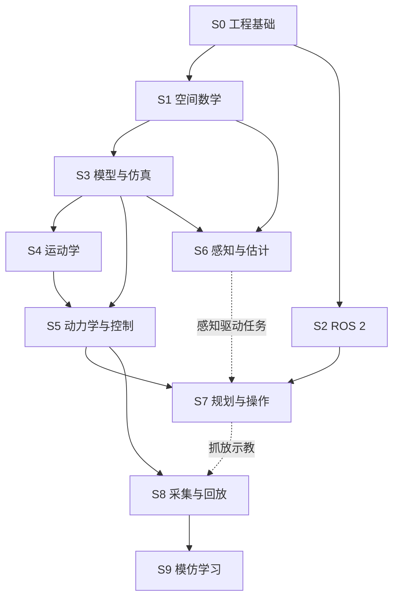

# 机器人工程学习路线：从可解释的基础到可复现的机械臂任务

本文行数：494行，预期阅读时长：23分钟

更新日期：2026-09-16。

本路线替代原来的固定 16 周计划。主线是**机械臂的建模、感知、规划、控制与仿真**，以当前 ROS 2、MuJoCo、MoveIt 和运动学案例为实践材料。它不试图在一个阶段覆盖整个机器人领域，也不把现有 lesson 编号当成先修顺序。

推进依据是能否解释、实现和验证一个能力，而不是某周是否过去。已有经验可通过阶段验收直接跳过相应练习；遇到缺口，只回补依赖知识。

**复习方式：** 默认直接阅读要点、例子、结果与解释，无需执行代码。下文的实践产物与验收项用于实际开发时的规划和验证，不是每次阅读的作业；只有例子难以说明的动态现象才安排可选实验。

## 阅读导航

- [路线为何这样调整](#design)
- [阶段与先修关系](#overview)
- [S0 工程与实验基础](#s0)
- [S1 空间数学与机器人表示](#s1)
- [S2 ROS 2 通信与系统组织](#s2)
- [S3 模型与可编程仿真](#s3)
- [S4 正逆运动学与数值求解](#s4)
- [S5 动力学、轨迹与反馈控制](#s5)
- [S6 感知、坐标对齐与状态估计](#s6)
- [S7 规划、接触与操作任务](#s7)
- [S8 数据采集、示教与回放](#s8)
- [S9 模仿学习与策略评估](#s9)
- [选修分支](#extensions)
- [现有进度与近期顺序](#next)
- [验收记录与资料](#evidence)

## 1. 路线为何这样调整

### 保留什么

- 保留已有 ROS 2、运动学、MoveIt、MuJoCo 和视觉练习，它们是可继续整理的案例。
- 保留“先完成小闭环，再增加复杂度”的学习方式。
- 保留详细笔记、失败原因、误差日志和个人理解过程。

### 补充什么

- 工程基础：环境、依赖、构建、调试、配置、版本与可重复实验。
- 空间基础：坐标系、变换方向、旋转表示、单位和维度。
- 系统基础：TF、时间、状态有效性、参数、数据记录和接口语义。
- 控制基础：动力学、采样、饱和、反馈与轨迹跟踪，区分求解误差和执行误差。
- 感知基础：测量误差、坐标对齐、延迟和最小状态估计。
- 评估基础：成功定义、固定场景集、失败分类和可比较的实验协议。

### 调整或取消什么

- 取消固定周数和“每周必须新增一个算法”的安排。
- 先用简单机器人与纯数值例子理解概念，再接入 Panda 等机械臂。
- Pinocchio 作为已有数值运动学主线；KDL 用于交叉验证，CasADi 等按需要扩展。
- 控制和规划先形成传统方法基线，再进入数据驱动方法。
- ACT、Diffusion Policy、强化学习不作为基础路线的必修验收。
- 算法比较允许出现没有提升的结果；结论应由实验支持，不把“新方法必须胜过旧方法”写成完成标准。

这里的先后安排是结合本仓库缺口作出的教学选择。理论参照 [Modern Robotics 的章节组织与先修要求](https://hades.mech.northwestern.edu/index.php/Modern_Robotics)，将构型与刚体运动、运动学、动力学、规划控制和操作逐步展开；实践顺序按现有材料作了调整。

## 2. 阶段总览与依赖

| 阶段 | 核心问题 | 进入条件 | 最小产物 |
| --- | --- | --- | --- |
| S0 工程基础 | 怎样稳定运行、修改和定位错误？ | 无 | 可重复的环境检查与最小程序 |
| S1 空间数学 | 位置、朝向、坐标变换如何表示？ | 基本 Python / NumPy | 点变换与简单机械臂几何验算 |
| S2 ROS 2 | 多个程序怎样协作并交换正确的数据？ | S0；TF 部分需要 S1 | 可验证的通信与坐标链 |
| S3 模型与仿真 | 机器人结构和仿真状态如何对应？ | S0、S1 | 模型加载、重置、步进、状态记录 |
| S4 运动学 | 关节与末端位姿怎样互相转换？ | S1、S3 | FK 对齐、Jacobian 检查与 IK 结果 |
| S5 动力学与控制 | 怎样让实际状态跟上目标？ | S3；末端控制需要 S4 | 执行器驱动的 reaching 与误差曲线 |
| S6 感知与估计 | 怎样从测量得到可用的任务状态？ | S1、S3；ROS 集成需要 S2 | 目标定位、坐标对齐和误差评估 |
| S7 规划与操作 | 怎样避障并完成可靠的抓放？ | S4、S5；MoveIt 集成需要 S2、S3 | 可重复抓放与失败记录 |
| S8 采集与回放 | 怎样保存可解释、可复用的动作数据？ | S5；抓放数据需要 S7 | 有明确时间和动作语义的 episode |
| S9 模仿学习 | 怎样从示教训练并评估策略？ | S8 + 学习算法基础 | BC 基线与独立 rollout 评估 |

S1 和 S2 可交替学习；纯 MuJoCo 实验不必等所有 ROS 2 高级内容学完。S7 先使用已知物体位姿完成操作，再接入 S6 的估计结果。图示主要依赖，具体要求以上表与阶段正文为准。

### 阶段里程碑

- **M1 系统基础**：环境能复现，能解释并验证坐标与通信链，覆盖 S0～S3。
- **M2 机械臂到达目标**：模型一致、IK 可解释、执行器控制有效，覆盖 S4～S5。
- **M3 感知驱动操作**：从相机定位到规划、抓放、失败报告，覆盖 S6～S7。
- **M4 学习策略实验**：示教可回放、BC 可训练、闭环结果可评估，覆盖 S8～S9。

M3 可以作为一轮完整机械臂工程学习的终点。希望深入机器人学习时再完成 M4；不要求所有方向同时推进。

## S0. 工程与实验基础

**目标：** 能运行案例、提供清楚的报错信息，并在 AI 协助修改后核对结果。S0 按需补缺口，不作为一套需要先全部学完的工具课程。

### 先会使用，细节按需查

- 知道从哪里启动程序、输入文件在哪里、使用什么运行环境。
- 能查看 Git 改动，区分代码、配置和运行产物。
- 看懂关键输入输出；数组形状、单位和数据含义由自己核对。
- 会按说明构建运行，能提供完整命令和报错，让 AI 协助定位。

Shell 机制、语言语法、构建配置等不要求系统深入；对象生命周期、线程等知识在影响实际机器人程序时再补。

### 在实际任务中按需使用

1. 跑通当前需要的案例，知道预期输出是什么。
2. 出错时提供启动目录、命令、报错与预期结果，借助 AI 修复并复查。
3. 留下简短的运行命令和必要环境说明，方便下次复现。

**验收：** 能按说明启动并核对输入输出；遇到问题知道需要收集哪些信息。已会的内容直接跳过。

### 单元入口

| 单元 | 内容与状态 |
| --- | --- |
| [01 终端、路径与环境](../src/foundations/engineering/01_shell_paths/README.md) | 四个要点、两个带结果解释的路径例子与速查 |
| [02 Git 与文件管理](../src/foundations/engineering/02_git/README.md) | 用改动摘要和提交状态例子解释协作；日常操作由 agent 完成 |
| [03 Python 与数值数据](../src/foundations/engineering/03_python_numeric/README.md) | Python、NumPy 形状与单位 |
| [04 C++ 与构建](../src/foundations/engineering/04_cpp_build/README.md) | `g++`、CMake target、ROS 2 `colcon` 与常见构建错误；已补充速记、例子和排错 |
| [05 调试与错误定位](../src/foundations/engineering/05_debugging/README.md) | 日志、最小复现、回溯与错误分类；已补充速记、例子和排错 |
| [06 配置与实验复现](../src/foundations/engineering/06_reproducibility/README.md) | 参数边界、环境记录、随机性与结果摘要；已补充速记、例子和排错 |

**已有材料：** 从 [S0 工程单元索引](../src/foundations/engineering/README.md)进入。单元 01～03 均采用直接阅读的例子；配套实现的验证与个人复习分开。需要时可将知识用于 [Lesson 1](../src/lesson1/README.md) 的整理与复现。

## S1. 空间数学与机器人表示

**目标：** 看到位置、旋转和变换矩阵时，知道它们描述什么、相对于谁、怎样参与计算。

### 建议顺序

1. [向量、范数、矩阵乘法、内积与叉积](../src/foundations/spatial_math/README.md)，连接到距离、投影和旋转轴。
2. 坐标系与基向量，区分几何对象和它在某个坐标系中的坐标。
3. 旋转矩阵、齐次变换、复合变换与逆变换。
4. 欧拉角、轴角、四元数的用途与约定；识别四元数排列差异。
5. 构型、自由度、关节空间与任务空间。
6. 导数、偏导与局部线性近似；最小二乘和 SVD 在 S4 实际使用时深入。

约定示例：`T_A_B` 将 B 系坐标转换为 A 系坐标，即 `p_A = T_A_B p_B`。笔记、图和代码采用一致的方向，不只写含糊的“相机外参”。

### 实验与验收

- 手算并用代码核对一次“旋转后平移”的点变换。
- 交换两个变换的乘法顺序，解释为何一般得到不同结果。
- 用逆变换把点变回原坐标系，记录数值误差。
- 画出 2R 平面机械臂并根据关节角计算末端位置，为 S4 提供几何参照。

**输出：** 一份符号与坐标约定、一组带预期数值的小例子。能解释矩阵各部分及单位，才继续依赖这些量的算法。

**已有材料：** [Lesson 3 的变换程序](../src/lesson3/lesson3.py)、[Lesson 4 的几何验算](../src/lesson4/lesson4_Modified_D-H.py)。先读几何部分，DH 的完整建系放在 S4。

## S2. ROS 2 通信与系统组织

**目标：** 建立可观察、可排错的数据与任务接口。

### 必修内容

- Workspace、package、node、topic、service、action，消息结构与接口生成。
- 参数、launch、命名空间和重映射。
- QoS 的实际匹配、定时器、回调、Executor 与异步请求。
- 时间戳、仿真时间、数据有效性与超时。
- TF 树、静态与动态变换、URDF 与 robot_state_publisher 的关系。
- CLI、日志、rosbag2 记录与回放；回放时同步检查时间与 TF。

### 实验与验收

1. 修复并验证 Lesson 1 的 Topic / Service / Action：成功、拒绝、取消和服务端迟到至少各有可解释的现象。
2. 改变命名空间或参数，确认实际通信名称和行为随配置变化。
3. 建立 `world → robot_base → end_effector` 的最小坐标链，并将一个点转换到目标坐标系。
4. 记录消息并回放，解释回放数据的时间含义，避免将旧状态当作实时测量。

**输出：** 通信图、接口说明、启动配置、日志和排错记录。不能用“节点都启动了”代替业务链路验证。

**已有材料：** [Lesson 1](../src/lesson1/README.md)。[Lesson 2](../src/lesson2/lesson2_composition/) 作为执行器和进程内通信的扩展，先完成基础通信，再研究组合与优化。

参考 [ROS 2 Humble 官方教程目录](https://raw.githubusercontent.com/ros2/ros2_documentation/humble/source/Tutorials.rst) 的基础到中级顺序。当前仓库已核对环境为 Humble，具体 API 按实际版本查证；不为学习路线自动要求升级整套环境。

## S3. 机器人模型与可编程仿真

**目标：** 知道模型怎样决定状态的含义，能在固定条件下重复实验。

### 必修内容

- URDF / MJCF 中的 link 或 body、joint、惯性、几何与碰撞模型。
- 坐标层级、关节轴、零位、限位、工具中心点和末端参考位置。
- `MjModel` / `MjData`、`qpos` / `qvel` / `ctrl`，名称到索引的映射。
- `nq` 与 `nv` 的区别：配置表示维度可能不同于速度自由度。
- `mj_forward` 与 `mj_step`，初始化、重置、仿真步长、渲染和控制频率。
- actuator 的输入语义、传动与控制范围；不能看到 `ctrl` 就直接认定它是力矩或角度。

### 实验与验收

1. 先用单摆或 2R 模型，读取关节和末端状态，再加载主要机械臂模型。
2. 输出 joint、actuator、body、site 的名称与索引对应表。
3. 固定初始状态、步长和输入，重复运行并比较状态记录；记录允许的数值差异。
4. 改变一个模型参数，解释它影响几何、运动学还是动力学。

**输出：** 模型来源与版本、字段表、重置和步进示例。外部模型未包含在仓库时提供获取方式和配置路径。

**已有材料：** [MuJoCo 目录与材料清点](../src/simulation/mujoco/README.md)、[Lesson 7](../src/lesson7/README.md)。本地 `~/mujoco_workspace` 已有 Panda 加载、步进、Viewer 与外加关节力控制脚本；目前仅核对源码，具体教程及控制效果验证待补。本阶段先阅读模型、状态与基础执行器部分，PID 与轨迹跟踪留到 S5。

MuJoCo 官方概览介绍了模型与动态数据的分离、模型编译和仿真步进，可作为结构性参考；实际 API 应切换到安装版本对应文档。参见 [MuJoCo Overview](https://mujoco.readthedocs.io/en/stable/overview.html)。

## S4. 正逆运动学与数值求解

**目标：** 把 `q → 末端位姿` 和 `目标位姿 → q` 解释清楚，先验证模型再求逆解。

### 建议顺序

1. 手写 2R FK，与几何公式比较。
2. 标准 DH 与 Modified DH 的建系和乘法顺序；明确使用哪种约定。
3. 导入机械臂模型，核对关节顺序、零位、基座与工具中心点。
4. 同一组关节状态下对齐仿真与 Pinocchio FK。
5. Jacobian 的输入输出、参考坐标系与有限差分验证。
6. 位置与姿态误差、SO(3) / SE(3) 和 log 的实际用途。
7. 伪逆、最小二乘、阻尼、迭代步长、关节限位与失败退出。

李群和李代数先解释代码中的旋转与位姿误差，再按需求深入推导。不要把熟记 API 当成理解误差的参考坐标系。

### 实验与验收

- 多组关节配置下比较 FK；位置与姿态误差分别报告，并解释固定工具偏移。
- 用有限差分检查 Jacobian 的方向与尺度，改变差分步长观察误差趋势。
- 从已知合法关节配置通过 FK 生成目标，再用 IK 求解并以 FK 验证结果；冗余机械臂不要求恢复同一组关节角。
- 加入不可达或不满足约束的目标，记录超时、未收敛或限位原因，不能无限迭代。

**输出：** 模型对齐说明、求解器输入输出、误差与失败表。容差先按模型尺度和数值精度制定，再执行实验，不事后放宽到“看起来通过”。

**已有材料：** [Lesson 4](../src/lesson4/lesson4_Modified_D-H.py)、[Lesson 9 FK 检查](../src/lesson9/check_fk_with_mujoco.py)、[Jacobian 笔记](../src/lesson9/qpos_jacobian_notes.md)、[位姿误差笔记](../src/lesson9/lie_group_lie_algebra_notes.md)。

## S5. 动力学、轨迹与反馈控制

**目标：** 从“求出了关节目标”推进到“执行器驱动下实际状态能跟踪目标”。

### 必修内容

- 单自由度质量、惯性、重力、阻尼和外力；再理解机械臂动力学方程各项职责。
- 位置、速度、力矩控制的输入差异；位置伺服器内部仍有动力学过程。
- 离散时间、采样、P / PD / PID、前馈与重力补偿。
- 控制饱和、积分累积、噪声与延迟、增益过大和时间步过大的现象。
- 路径与带时间的轨迹，速度 / 加速度限制、简单插值与平滑。
- 关节轨迹跟踪，再接 IK 或 Jacobian 生成末端目标对应的控制参考。

### 实验与验收

1. 单关节阶跃和正弦跟踪，对比两组增益，记录误差、超调、稳定时间与控制输入。
2. 多关节轨迹执行，记录关节目标与实际值、限位 / 饱和情况。
3. 完成多个末端目标的 reaching；同时报告 IK 求解残差和仿真实际跟踪误差。
4. 加入一种扰动或负载变化，分析误差来源；目标不可达时有明确退出行为。

**M2 验收边界：** 初始化可以设置 `qpos`，但闭环执行阶段应通过定义清楚的 actuator 输入推进仿真。直接每步覆盖 `qpos` 只能验证运动学展示，不能作为动力学跟踪通过的证据。

**输出：** 控制配置、目标 / 实际 / 误差曲线、失败说明。位置误差和姿态误差使用独立单位与阈值；需要合并时明确权重和物理含义。

**已有材料：** [Lesson 7 PID](../src/lesson7/PID.py)、[关节轨迹](../src/lesson7/joint_space_trajectory_tracking_demo.py)、[Lesson 9 末端控制](../src/lesson9/control_ee_with_pinocchio.py)与 [里程碑脚本](../src/lesson9/kinematics_milestone.py)。先核对每种执行模式，再判断能覆盖哪些验收项。

## S6. 感知、坐标对齐与状态估计

**目标：** 将图像和传感器数据变成有坐标、时间和误差说明的任务状态。

### 必修内容

- 针孔成像、像素坐标、相机内参、畸变、外参和投影。
- 仿真图像读取、颜色顺序、图像原点与相机坐标约定。
- 标定、AprilTag 角点、PnP 的输入输出和尺度来源。
- `camera → target` 与 `world → camera` 的组合；眼在手上与固定相机的变换链。
- 检测失败、过期测量、异常值、噪声和滤波延迟。
- 均值、方差、最小滤波实验；在简单一维位置 / 速度例子上理解 Kalman 预测与更新，再决定是否扩展到机器人状态融合。

### 实验与验收

1. 用已知模型尺寸和相机参数生成图像，估计标记位姿，与仿真真值比较。
2. 把目标转换到机器人基座坐标系；改变相机位置，检查最终空间关系是否仍一致。
3. 分别统计重投影误差和三维位姿误差，避免仅凭图像角点“对上了”判断全部正确。
4. 加噪、遮挡或暂停数据，观察估计输出和有效性标志；对比滤波前后误差与延迟。

**输出：** 坐标链图、相机配置、测量字段与时间定义、误差结果。S7 接入感知时只能使用声明有效的测量。

**已有材料：** [Lesson 8 视觉笔记与脚本](../src/lesson8/cv_trainning/README.md)。滤波与状态估计属于待补单元。

标定与 PnP 的 API、参数含义查 [OpenCV 相机标定与三维重建文档](https://docs.opencv.org/4.13.0/d9/d0c/group__calib3d.html)。此链接是资料核对时解析到的版本，不代表仓库已安装或必须升级到该版本。

## S7. 规划、接触与操作任务

**目标：** 完成可重复、可评估的机械臂任务，并能解释失败发生在哪个环节。

### S7A：运动规划与执行

- 构型空间、障碍物、自碰撞、关节限位和状态有效性。
- 从目标状态到几何路径，再到时间参数化轨迹，最后执行。
- 了解采样规划的思路，先使用一个规划器完成案例，再研究其他算法。
- MoveIt 的 robot model、planning scene、planning group、规划请求与执行接口。
- 控制器与轨迹接口的对应；规划成功和执行成功分别记录。

**实验：** 无障碍到达 → 加一个障碍物 → 加入失败目标。比较规划轨迹与实际轨迹，检查约束、碰撞和失败位置。

### S7B：接触与抓取

- 接触法向、摩擦、质量与惯性、夹爪力和接触稳定性。
- 预抓取、接近、闭合、抬升、移动、放置和释放的状态流程。
- MTC 中 Task / Stage、属性传递、对象附着与规划场景更新。
- 用已知物体位姿完成抓放，再替换为 S6 的估计位姿。

**实验：** 固定场景抓放 → 改变物体初始位置 → 接入感知 → 记录抓空、滑落、碰撞和规划失败。

### M3 验收

- 预先定义抓放成功：例如物体进入目标区域、释放后保持稳定、过程无禁止碰撞；区域和保持时长由具体场景写入配置。
- 先固定一组场景与随机种子再运行，建议用至少 20 次试验作初步统计；这个数量是本路线的练习建议，不是通用可靠性标准。
- 报告成功次数 / 总次数、完成时间和失败类型；失败试验不能从分母删除。
- 展示完整链路：测量 → 坐标转换 → 目标 → 规划 → 控制 → 接触结果 → 评价。

**已有材料：** [Lesson 5](../src/lesson5/draw_line_and_circle.cpp)、[Lesson 6](../src/lesson6/README.md)，以及独立工作区 `~/moveit-from-zero-tutorial`。MoveIt 教程参考 [Humble 入门文档](https://moveit.picknik.ai/humble/doc/tutorials/getting_started/getting_started.html)。独立工作区中的代码、模型和构建结果不复制到本仓库；这里维护主题入口、接口边界和验收标准。

**集成策略：** MoveIt / MTC 案例可以先在其已有执行环境中验证；MuJoCo 接触实验也可独立推进。两者连通需要关节顺序、时钟、轨迹执行接口和状态反馈的明确适配，不默认启动两个工具后就自动组成一个系统。最终任务先选择一条可验证的执行链，另一条作为后续集成。

## S8. 数据采集、示教与回放

**目标：** 数据能准确回答“当时观察到什么、发出了什么动作、之后发生了什么”。

### 必修内容

- episode、observation、action、timestamp、终止状态与成功标签。
- 动作语义：关节位置、速度、力矩或末端增量；增量必须写清参考坐标系。
- 时间对应：例如 `obs_t → action_t → obs_(t+1)`，说明采样在仿真步进前还是后。
- 图像、关节状态、目标位姿的同步与缺失处理。
- reset、采集开始 / 结束 / 丢弃、人工示教或脚本示教、保存和回放。
- 数据版本、模型和相机配置、来源与基本质量检查。

### 实验与验收

1. 先存一条短 reaching 轨迹，检查数组形状、单位、时间单调性和动作范围。
2. 重新加载场景并回放，比较原始与回放状态；解释由于闭环反馈或物理扰动造成的差异。
3. 再采集抓放示教，保存成功和失败标签，不混淆命令动作与实际关节状态。
4. 记录丢帧、缺字段和非法值时的处理行为。

**输出：** 数据字典、采集与回放入口、小型示例和检查结果。可以先沿用 `.npz` 验证语义，数据规模或训练接口需要时再选 HDF5、Zarr 或 LeRobot 格式。

**已有材料：** [Lesson 8 综合采集 Demo](../src/lesson8/cv_trainning/demo/sim_camera_tag_pose_demo.py)。已有保存代码不等于已完成数据对齐和可回放验收。

## S9. 模仿学习与策略评估

**进入条件：** S8 的数据可读、可解释、可回放；已有传统控制或规划基线。补齐监督学习、训练 / 验证划分、归一化、损失函数、梯度优化、过拟合与基本 PyTorch 使用。通用机器学习资料保存在独立仓库 `~/machine_learning_project`，机器人任务接入仍需按 S8 的数据契约重新核对。

### 现有机器学习探索

`~/machine_learning_project` 已保存一组由浅入深的练习：

- KNN：以 Iris 等小数据集理解特征、距离和分类基线。
- 回归、决策树与模型选择：比较指标、数据划分和过拟合风险。
- 聚类：理解无标签数据的分组和评估限制。
- PyTorch 数字识别与迁移学习：连接张量、训练循环、checkpoint 和预训练模型。

这些资料可以作为 S9 的算法先修和基线，但不能直接证明机械臂策略有效。接入机器人前仍需明确 observation、action、时间对齐、归一化统计、独立测试场景和闭环成功定义。

### 必修到 BC 基线

1. 先用低维状态输入和简单 MLP 做行为克隆（BC），明确模型预测什么动作。
2. 先检查能否拟合少量样本，再扩大数据集；训练目标与推理输出语义一致。
3. 按 episode 或场景划分训练 / 验证 / 测试，避免把同一轨迹的相邻帧分散后当成独立泛化验证。
4. 归一化统计只从训练集计算，训练与 rollout 使用同一变换。
5. 加载 checkpoint 在环境中闭环执行，观察误差累积和偏离示教分布。
6. 低维 BC 稳定后，再加入图像；失败时先检查视角、坐标、时间对齐和动作缩放。

### M4 验收

- 保存数据版本、划分、训练配置、随机种子、checkpoint 和评估场景。
- 报告训练 / 验证曲线与闭环成功率；低验证损失不能代替任务成功。
- 与传统控制或脚本示教基线在相同任务定义下比较，说明输入信息是否相同。
- 至少分析一类闭环失败，能提出并验证一个具体改进假设。
- 使用独立测试场景；先报告固定条件结果，再做扰动与泛化实验。

**已有材料：** 通用机器学习练习见 `~/machine_learning_project`；当前仓库已有 S8 采集示例，但还没有把这些分类、回归或神经网络练习接成完整机器人 BC 训练与闭环评估案例。先完成低维 BC，再考虑图像和更复杂策略。

后续若使用 LeRobot，可参考其 [采集、训练与评估工作流](https://huggingface.co/docs/lerobot/il_robots)。该教程面向真实机器人，不能把其中硬件步骤直接当成本仓库 MuJoCo 适配方案；选用时要核对数据与环境接口版本。

## 3. 选修分支：主线之外怎样扩展

机器人知识面很广。以下分支保留入口，按项目需要选择，不同时列为当前必修。

| 分支 | 推荐进入条件 | 先完成的最小问题 |
| --- | --- | --- |
| 进阶策略：历史窗口、ACT、Diffusion Policy | S9 有可用 BC 基线 | 在固定任务与数据划分下验证一种改进是否有效 |
| 强化学习 | S3、S5 和基本机器学习 | 明确观测、动作、奖励、终止与评估，先做简单任务 |
| 力控、阻抗与导纳 | S5、S7 接触基础 | 用单轴接触实验解释力、位移和控制参数的关系 |
| 优化式 IK、轨迹优化、MPC | S4、S5，补约束优化 | 明确变量、代价与约束，和现有方法比较 |
| 移动机器人与 SLAM | S1、S2、S6，补概率与传感器模型 | 里程计 → 定位 → 建图 → 导航，另建完整分支 |
| 真机与嵌入式 | S0、S2、S5 | 驱动、通信总线、编码器、标定、限位和停止机制；按具体硬件制定流程 |
| 机械设计与电气 | 按实际装配需求 | 机构、传动、选型、供电和测量的基础实验 |
| 双臂与灵巧手 | 单臂 S7 验收完成 | 多链坐标、协同约束与接触；先缩小自由度和任务范围 |

这些方向没有单一的总排序。确定下一阶段目标后，再为所选分支制定先修知识和验收路线。

## 4. 当前材料与近期建议

### 进度如何理解

目前能确认的是“哪些代码和笔记存在”，不能仅凭旧路线的冻结标记或脚本文件名判断能力已经验收。旧记录中提到的既往实践是有价值的背景，但新路线的状态应补上对应证据。

| 材料 | 当前可确认状态 | 下一步 |
| --- | --- | --- |
| S0 单元 01 | 路径例子与速查已完成，配套代码此前通过 10 项自动检查 | 阅读结果与解释，快速回忆路径规则 |
| S0 单元 02 | Git 协作例子与速查已完成 | 看懂改动、提交与推送状态即可 |
| Lesson 1 | 详细文档已整理；当前接口依赖缺失；已记录静态问题 | 找回接口、修复构建和通信流程、保存运行证据 |
| Lesson 2 | 有组合与进程内通信源码 | 核对构建，补执行机制笔记 |
| Lesson 3 / 4 | 有变换与 2R MDH 数值例子 | 补坐标约定、推导和自检结果 |
| Lesson 5 / 6 | 有 MoveIt / MTC 代码和部分运行说明 | 补模型、规划与控制接口、任务成功定义 |
| Lesson 7 / 8 | 有较长笔记和仿真、控制、视觉、采集代码 | 按主题拆解阅读，核对外部资源和实验结果 |
| Lesson 9 | 有 FK / IK / 控制脚本与专题笔记 | 核对模型一致性、执行模式与数值指标 |

完整对应关系见 [实践案例索引](../src/README.md)。

### 近期按这个顺序推进

1. **从 S0 的例子回忆工程基础**：直接查看路径与 Git 协作示例，后续按需要补其他单元。
2. **使 Lesson 1 可复现**：补齐接口来源和依赖，修复名称、重试与任务状态，完成受控通信实验。
3. **整理 Lesson 3 / 4**：建立全仓库坐标与符号约定，用小例子确认数学基础。
4. **拆读 Lesson 7 / 9**：先模型与 FK，再 IK，最后执行器控制，以 M2 reaching 为第一项综合验收。
5. **整理 Lesson 8 的感知部分**：相机 → 位姿 → 坐标转换 → 误差与有效性。
6. **回到 Lesson 5 / 6**：在运动学与控制基础上解释规划和抓放，再形成 M3。
7. **最后完善采集与学习**：先回放验收，再决定进入 BC 以及后续选修。

Lesson 2 的执行机制可在 Lesson 1 之后补充；不把性能优化作为完成 M2 的前置门槛。已有部分若能提交充分验收证据，可直接进入下一步。

### 每次学习的小循环

选一个问题 → 查看核心结论 → 阅读例子的输入、结果与解释 → 有疑问再补原理。需要开发或研究动态现象时，再运行针对性的验证并记录实际结果。

路线不指定每天时长，复习时选择当前需要回忆的知识点即可。实际开发再按里程碑拆分任务、验证结果；外部项目的新需求归入对应阶段或选修分支。

## 5. 验收记录与资料使用

### 每个阶段保留的记录

| 字段 | 要求 |
| --- | --- |
| 问题与假设 | 这次实验想验证什么，改变哪个因素 |
| 环境与来源 | 软件版本、模型 / 数据来源、源码版本或改动说明 |
| 输入输出 | 类型、维度、单位、坐标系、时间关系和有效范围 |
| 方法与前提 | 使用的算法、近似条件和已知限制 |
| 成功条件 | 实验前确定的阈值、场景集和失败处理 |
| 实际证据 | 命令、关键日志、曲线或指标表 |
| 结论与缺口 | 哪些已证实、哪些只是推测、下一步如何验证 |

状态建议使用“材料已有”“可运行”“结果已验证”“原理待补充”，需要时分别记录。个人是否掌握由用户复习判断；自动化检查只能提供部分证据。

### 资料选择

正文链接对应理论教材和官方工具文档，不要求把它们全部读完。按阶段的问题阅读对应章节；视频可帮助建立直觉，公式与 API 再回到原始资料核对。

Modern Robotics 适合空间表示、运动学、动力学与规划控制；ROS 2 教程适合系统组织；MuJoCo、MoveIt、OpenCV 文档分别服务于仿真、规划和视觉接口。上述资源用途是本路线的建议，不代表这些项目共同发布了本学习路径。

路线、案例索引和专题笔记的职责分别是“下一步学什么”“代码在哪里”“概念怎样理解”。使用 [文档样板](lesson-template.md)继续补充，避免把全部解释堆到这份路线里。
