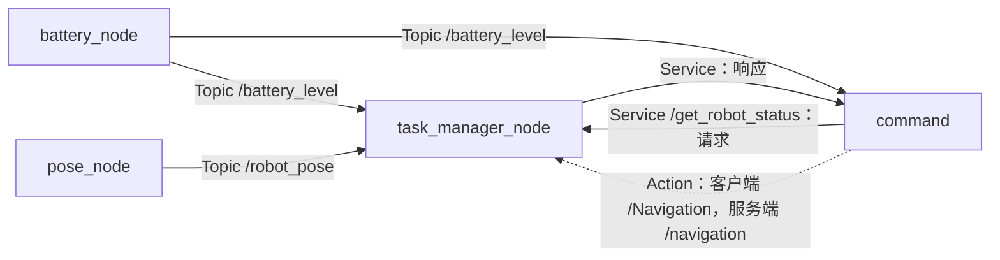

# Lesson 1：ROS 2 接口与通信实践

本文行数：151行，预期阅读时长：6分钟

本课用电量发布、位置发布、状态查询和导航任务四个节点，学习 Topic、Service、Action 如何传递数据，以及接口定义如何对应到 C++ 代码。

**当前状态：文档与源码已核对，完整运行待验证。** 整理日期：2026-09-16。当前环境为 ROS 2 Humble，但找不到 `robot_interfaces` 包；源码还存在构建依赖遗漏和通信逻辑问题，见下文。本文中的预期现象不代表已测结果。

## 1. 阅读入口

- [详细笔记：ROS 2 接口与通信](ros2_interfaces_notes.md)：概念、代码拆解、自定义接口、执行机制和复习题。
- [已知问题与排查](ros2_interfaces_notes.md#issues)：当前源码的限制和建议处理方法。
- [通用 lesson 样板](../../doc/lesson-template.md)：以后整理其他课程时复用。
- [知识索引](../../doc/README.md) · [仓库首页](../../README.md)

快速复习：看通信图 → 阅读相关概念与[通信场景示例](ros2_interfaces_notes.md#experiments)。下面的环境和运行说明供需要实现或排错时查阅，无需逐项执行。

## 2. 学习目标与前置知识

完成本课后，应能：

- 根据数据用途选择 Topic、Service 或 Action。
- 区分节点名、可执行文件名、接口类型和通信名称。
- 从一条消息追踪到订阅回调、状态缓存、服务响应和 Action 反馈。
- 解释异步请求、Executor、线程和互斥锁在本例中的作用。
- 用命令行定位名称不一致、依赖缺失和任务不结束的问题。

前置知识：C++ 类、模板、lambda、智能指针的基本读法；终端命令和 CMake 的基础概念。相关语法在笔记中结合代码解释。

## 3. 文件与职责

| 文件 | 职责 | 重点入口 |
| --- | --- | --- |
| [battery_node.cpp](ros2_comm_demo/src/battery_node.cpp) | 每秒生成并发布电量 | `timer_callback()` |
| [pose_node.cpp](ros2_comm_demo/src/pose_node.cpp) | 每秒生成并发布位置 | `timer_callback()` |
| [task_manager_node.cpp](ros2_comm_demo/src/task_manager_node.cpp) | 缓存状态，响应查询，执行任务检查 | `on_get_robot_status()`、`execute_navigation()` |
| [command_node.cpp](ros2_comm_demo/src/command_node.cpp) | 查询状态，尝试发送导航目标 | `send_request()`、`send_goal()` |
| [CMakeLists.txt](ros2_comm_demo/CMakeLists.txt) | 编译和安装四个可执行文件 | `find_package`、`ament_target_dependencies` |
| [package.xml](ros2_comm_demo/package.xml) | 声明包信息和依赖 | `depend` |
| [launch.py](ros2_comm_demo/launch/launch.py) | 启动四个节点进程 | `generate_launch_description()` |

## 4. 通信关系

图中名称按默认无命名空间、无重映射的启动方式展开。虚线表示当前未连通的预期 Action 链路。



导航服务端读取位置、计算距离并返回反馈。当前代码没有向机器人发送运动控制量，位置由 `pose_node` 独立生成。

## 5. 环境与运行前提

| 项目 | 当前证据或要求 |
| --- | --- |
| ROS 2 | 整理时 `ROS_DISTRO=humble`，安装目录为 `/opt/ros/humble` |
| C++ | 本包 CMake 指定 C++17 |
| 工具 | 需要 `colcon`、`ament_cmake`、ROS 2 CLI |
| 标准依赖 | `rclcpp`、`rclcpp_action`、`std_msgs`、`geometry_msgs`、launch 相关包 |
| 自定义依赖 | `robot_interfaces`；当前仓库未包含其源码，当前终端中 `ros2 pkg prefix robot_interfaces` 返回 `Package not found` |
| 构建修补前提 | 显式补齐 `rclcpp_action` 的 CMake / manifest 依赖；详见笔记“构建与启动” |
| 系统与中间件 | 操作系统具体版本、RMW 实现与完整运行日志待实际复现时记录 |

以下命令在**仓库根目录**执行。先加载 ROS 2；若自定义接口来自其他工作空间，还要加载那个工作空间的 `install/setup.bash`。具体外部路径需由实际接口来源确定。

```bash
source /opt/ros/humble/setup.bash
ros2 pkg prefix robot_interfaces
ros2 interface show robot_interfaces/srv/GetRobotStatus
ros2 interface show robot_interfaces/action/Navigation
```

接口找不到时先解决来源或构建问题。笔记给出的接口定义是教学草案，不能当作恢复出的原始接口。

### 5.1 构建并启动

**先满足上面的依赖前提并处理构建配置遗漏，再执行本节。** 这里只构建 Lesson 1；选择包并不会自动安装缺失的依赖。

```bash
colcon build --base-paths src/lesson1 --packages-up-to ros2_comm_demo
source install/setup.bash
ros2 launch ros2_comm_demo launch.py
```

如果 `robot_interfaces` 是本工作空间内新补充的源码包，它也需要位于 `--base-paths` 的搜索范围内；外部已安装接口则通过前面加载的环境提供。

每个新终端都要加载 ROS 2、自定义接口所在环境及本仓库构建环境。仅有旧的 `install/` 目录不能证明当前源码可构建或当前运行的就是最新代码。

### 5.2 检查 Topic 与 Service

启动后，在另一个已加载环境的终端运行；持续输出的命令用 `Ctrl+C` 结束后再执行下一条。

```bash
ros2 node list
ros2 node info /task_manager_node
ros2 topic list -t
ros2 topic echo /battery_level
ros2 topic echo /robot_pose
ros2 topic hz /robot_pose
ros2 service list -t
ros2 service call /get_robot_status robot_interfaces/srv/GetRobotStatus '{}'
```

源码推导的预期：

- 节点名包括 `/battery_node`、`/pose_node`、`/task_manager_node`、`/command`。
- 电量从第一次发布的 99 逐步降到 0；晚加入的订阅者不一定看到 99。
- 位置的 `x` 每次增加 0.1，`y=z=0`，`header.frame_id` 为 `map`；发布频率约 1 Hz。
- Service 返回任务管理节点最近缓存的状态；刚启动、尚未收到 Topic 时可能是初始值。

### 5.3 检查 Action

```bash
ros2 action list -t
ros2 action info /navigation
ros2 node info /command
```

当前客户端查询的是 `/Navigation`，服务端提供 `/navigation`，因此默认启动无法自动建立这一任务链路。即使修正名称，目标 `(5, 3)` 与 `y=0` 的位置生成逻辑也不匹配。完整启动不应被描述为“导航成功”。

反馈、成功与取消的区别见[通信场景示例](ros2_interfaces_notes.md#experiments)，其中直接给出条件、结果与原因；示例中的位置更新不代表机器人真实移动。

## 6. 已知问题摘要

| 问题 | 影响 |
| --- | --- |
| 自定义接口包缺失、`rclcpp_action` 依赖未显式声明 | 当前无法确认干净环境下的完整构建 |
| Action 名称大小写不一致 | 客户端找不到对应服务端 |
| 首次发送前取消定时器 | 服务端未及时上线时不会自动重试 |
| 目标不在模拟位置轨迹上 | 修正名称后任务仍不能自然成功 |
| 无状态有效性、超时和失联检查 | 可能使用初始值或旧位置，任务长期不结束 |
| 分离线程与任务占用标记存在限制 | 需要进一步处理退出生命周期和并发接单 |

详细原因、代码位置和验证办法统一维护在[问题记录](ros2_interfaces_notes.md#issues)中。

## 7. 验证记录

| 日期 | 检查 | 结果 |
| --- | --- | --- |
| 2026-09-16 | 阅读四个节点、构建文件和 launch | 完成源码核对，问题已记录 |
| 2026-09-16 | 环境检查与 `colcon list --base-paths src/lesson1` | Humble 环境可见，识别到 `ros2_comm_demo` |
| 2026-09-16 | 查找自定义接口包 | 当前环境返回 `Package not found` |
| 待记录 | 完整构建、Topic / Service / Action 实验 | 未执行；待补齐运行前提 |

后续复现时补充：源码版本、依赖来源、命令、实际日志、预期与实际的差异。学习目标的掌握程度由自己复习后填写。
