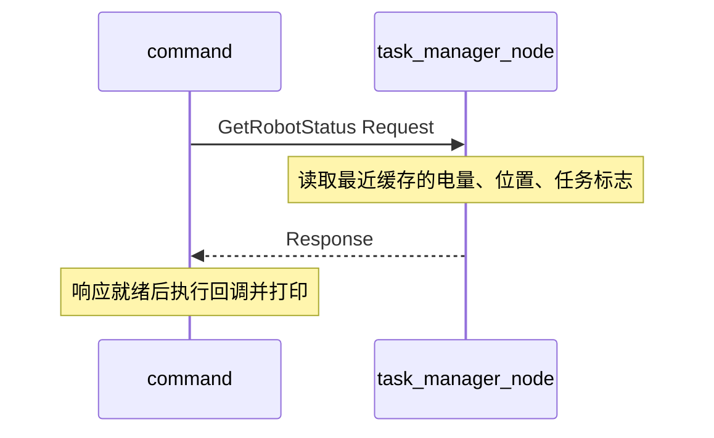

# Lesson 1 笔记：ROS 2 接口与通信

本文行数：585行，预期阅读时长：22分钟

本篇用当前四个节点回答：数据怎样传递，什么时候用 Topic / Service / Action，接口文件怎样变成 C++ 类型，以及代码为什么需要回调、Executor 和线程。

适用基准：ROS 2 Humble，2026-09-16 核对。来源包括本课源码、当前安装的 Humble 头文件 / 消息定义，以及 ROS 2 官方文档 Humble 分支。**完整程序尚未构建运行；本文区分源码行为、教学草案与示例推导。** 环境和运行入口见 [README](README.md)。

## 目录

- [1. 通信方式与接口类型](#concepts)
- [2. 节点、名称与 C++ 对象](#names)
- [3. Topic：电量和位置](#topics)
- [4. Service：查询缓存状态](#services)
- [5. Action：导航任务的生命周期](#actions)
- [6. 自定义接口与生成代码](#interfaces)
- [7. Executor、回调和并发](#execution)
- [8. 构建与启动](#build)
- [9. 排错与当前问题](#issues)
- [10. 通信场景示例](#experiments)
- [11. 复习题与速查](#review)
- [12. 参考资料与后续主题](#references)

<a id="concepts"></a>

## 1. 通信方式与接口类型

### 1.1 从本课需求出发

电量会持续变化，其他节点需要不断接收；状态查询由调用方主动发起，希望获得一次答复；导航任务可能持续一段时间，需要知道是否接单、当前进度和最终结果。

| 方式 | 本课用途 | 数据组织 | 调用方关心什么 |
| --- | --- | --- | --- |
| Topic，话题 | 发布电量和位置 | 一条条消息 | 最新读数或连续数据 |
| Service，服务 | 获取机器人状态 | Request → Response | 这次查询的答复 |
| Action，动作 | 提交导航目标 | Goal、Result、Feedback | 接受情况、进度和终态 |

接口描述定义了数据结构，通信代码决定怎样使用它。`.msg` 描述消息字段；`.srv` 用一个 `---` 分隔请求和响应；`.action` 用两个 `---` 按 **Goal → Result → Feedback** 分段。文件中的顺序与运行时“先反馈、后结果”的时间顺序不同。参见 [官方接口说明](https://raw.githubusercontent.com/ros2/ros2_documentation/humble/source/Concepts/Basic/About-Interfaces.rst)。

### 1.2 容易混淆的边界

- Topic 可以有多个发布者和多个订阅者；本课电量同时被两个节点订阅。
- 发布一次 Topic 不会自动得到“业务处理成功”的响应。需要确认完成时，应设计响应协议或选择 Service / Action。
- Service 的请求响应形式不要求客户端同步阻塞；本课使用异步请求。
- Action 提供任务管理机制，但不会自动实现导航算法、运动控制、超时或故障处理，这些都由业务代码负责。

本课“导航”具体做的是：读取位置 → 计算距离 → 发布反馈 → 检查是否到达。要发展为完整运动闭环，还需要产生控制命令并让位置随目标变化。

<a id="names"></a>

## 2. 节点、名称与 C++ 对象

### 2.1 四种名字分别是什么

以 [command_node.cpp](ros2_comm_demo/src/command_node.cpp) 为例：

| 层次 | 当前值 | 用途 |
| --- | --- | --- |
| C++ 类名 | `CommandNode` | 源码中的类 |
| 可执行文件名 | `command_node` | `ros2 run` 或 launch 选择的程序 |
| ROS 节点名 | `command` | 构造函数 `Node("command")` 指定，图中显示为 `/command` |
| Action 类型 | `robot_interfaces::action::Navigation` | 定义 Goal / Result / Feedback 的数据结构 |
| Action 名称 | 客户端 `Navigation`，服务端 `navigation` | 运行时寻找通信对象的名称 |

类型名里的 `Navigation` 与运行时名称可以采用不同命名风格；但客户端与服务端的**运行时名称必须对应**。当前两端名称大小写不同，是具体的通信问题。

代码使用不带开头 `/` 的相对名称。默认无命名空间时，`battery_level` 展开为 `/battery_level`；放入命名空间后会随之变化。调试时检查展开后的实际名称，不仅看源码字符串。

### 2.2 节点如何开始工作

四个程序都采用以下结构，下面以电量节点源码为例：

```cpp
rclcpp::init(argc, argv);
rclcpp::spin(std::make_shared<BatteryNode>());
rclcpp::shutdown();
```

`init` 初始化 ROS 上下文并处理相关参数；`make_shared` 创建节点对象，构造函数注册发布者和定时器；`spin` 持续处理就绪的回调；结束后调用 `shutdown` 关闭上下文。

注册回调只是告诉系统“事件发生时执行什么”。构造函数执行完不意味着定时器或订阅回调已经运行。

<a id="topics"></a>

## 3. Topic：电量和位置

### 3.1 先定义数据语义

| Topic 与类型 | 字段 | 本课语义与约定 |
| --- | --- | --- |
| `/battery_level`，`std_msgs/msg/Int32` | `data` | 用整数表示电量百分数；源码从 100 开始，每次发布前减 1，最低 0 |
| `/robot_pose`，`geometry_msgs/msg/PointStamped` | `header.stamp` | 节点时钟给出的时间戳 |
| 同上 | `header.frame_id` | 字符串 `map`，声明点的参考坐标系 |
| 同上 | `point.x/y/z` | 三个 `float64` 位置分量；按本课距离日志约定为米 |

`Int32` 类型本身只约束有一个整数，不知道它表示电量，也不限制为 0～100。当前安装的 Humble `std_msgs/msg/Int32.msg` 注释将它定位为旧的示例消息，并建议使用有明确语义的消息。本课沿用现有代码；扩展真实电池状态时，应再选择合适的标准消息或定义语义清楚的接口。

`PointStamped` 表示带时间戳和坐标系的**位置点**，不包含姿态。虽然话题叫 `robot_pose`，当前数据不能表达机器人朝向。

写入 `frame_id="map"` 也不会创建 TF 变换或把坐标自动变换到 `map`。生产者和消费者必须对坐标含义达成一致；本例任务管理节点只取 `msg->point`，没有保留或检查 header。

### 3.2 发布者：类型、名称和频率分开理解

[battery_node.cpp](ros2_comm_demo/src/battery_node.cpp) 中的关键代码：

```cpp
publisher_ = this->create_publisher<std_msgs::msg::Int32>("battery_level", 10);
timer_ = this->create_wall_timer(1000ms, [this]()
                                 { timer_callback(); });
```

- `<std_msgs::msg::Int32>`：本发布者接收的消息类型。
- `"battery_level"`：通信名称。
- `10`：通过 QoS 便捷构造指定历史深度，控制缓存相关行为。
- `1000ms`：定时器周期，期望每秒调用一次回调。
- `[this]`：lambda 捕获当前对象指针，从而调用成员函数并访问成员变量。
- `publisher_`、`timer_` 保存为成员：使这些对象在节点运行期间保持存活。

因此，**`10` 不表示 10 Hz**。本例的名义频率由 `1000ms` 决定，实际回调还受调度和执行耗时影响。

发布回调先生成消息、填入 `message.data`，再调用 `publisher_->publish(message)`。调用发布函数不会直接执行另一个进程的订阅 lambda。

### 3.3 订阅者：消息怎样变成节点状态

[task_manager_node.cpp](ros2_comm_demo/src/task_manager_node.cpp) 的 `init_subscribers()` 注册订阅，回调再调用 `on_battery_received()`：

```cpp
current_battery_ = msg->data;
```

可以把链路读成：

```text
BatteryNode 的成员 battery_level
  → Int32 消息的 data
  → /battery_level
  → TaskManagerNode 的订阅回调
  → 成员 current_battery_
  → 后续 Service 响应的 battery_level
```

`SharedPtr` 是管理消息对象生命周期的智能指针。看到这个类型不应推断跨进程通信就是“共享同一块内存”或“零拷贝”；本课没有验证这种传输优化。

`CommandNode` 也订阅电量并更新自己的 `current_battery_`，但当前发送目标逻辑没有使用这个值。低电量拒绝任务尚未实现。

### 3.4 QoS：缓存、可靠性与晚加入者

QoS 是通信质量策略。当前安装的 `rclcpp/qos.hpp` 说明 `QoS(size_t)` 等价于用 `KeepLast(depth)` 初始化，默认配置包含 Reliable 和 Volatile。

本课重点记三项：

| 策略 | 当前用法 | 复习时怎样理解 |
| --- | --- | --- |
| History / Depth | Keep Last，10 | 保留有限历史样本；不是无限积压队列 |
| Reliability | Reliable | 使用可靠传递机制；不等于对方业务已经处理成功 |
| Durability | Volatile | 不为晚加入订阅者提供持久历史回放 |

两端 QoS 要兼容，不要求每个值完全相同。例如 Best Effort 发布者无法满足 Reliable 订阅者；Reliable 发布者可匹配 Best Effort 订阅者。名字和类型正确但收不到数据时，应检查 QoS。参见 [官方 QoS 策略与兼容性表](https://raw.githubusercontent.com/ros2/ros2_documentation/humble/source/Concepts/Intermediate/About-Quality-of-Service-Settings.rst)。

```bash
ros2 topic info /battery_level --verbose
ros2 topic hz /battery_level
```

第一条看端点与 QoS，第二条测观察到的频率。持续测量用 `Ctrl+C` 结束。诊断命令自身也可能创建订阅者，因此端点数量不一定只包含本课节点。

### 3.5 时间戳与定时器不是同一个概念

`pose_node` 用 `create_wall_timer` 触发周期回调，再用节点的 `get_clock()->now()` 填时间戳。前者的调度与后者的时间来源应分别理解；以后接入仿真时间时，不应假设它们必然同步暂停。

当前 Service 和 Action 使用的缓存没有保留位置时间戳，所以无法根据缓存判断位置是否已经过期。发布端带有时间信息，不代表整条链路都正确使用了它。

<a id="services"></a>

## 4. Service：查询缓存状态

### 4.1 一次调用经过哪些步骤

`CommandNode` 每 3 秒触发 `send_request()`：

1. `wait_for_service(1s)` 最多等待一秒，检查服务是否可用。
2. 创建 `GetRobotStatus::Request`。当前代码没有给请求字段赋值。
3. `async_send_request` 提交请求并注册结果回调。
4. 服务端 `on_get_robot_status()` 将缓存写入 Response。
5. 客户端结果回调通过 `future.get()` 取得响应并打印。



### 4.2 Future 与“异步”的含义

Future 可以理解为未来结果的获取入口。这里 `future.get()` 位于响应就绪后的回调中；不要把它移动到请求发出后的定时器回调里立即等待，否则可能占用负责处理响应的执行线程。

`async_send_request` 是异步发送，但前面的 `wait_for_service(1s)` 仍然会阻塞当前回调一段时间。“使用了异步 API”不代表整个函数的每一步都不等待。

### 4.3 返回的是缓存，不是同时采样

响应包含源码中使用的 `battery_level`、`x/y/z` 和 `has_task`。这些值来自不同时间到达的 Topic 或任务线程：

- 查询不会要求电量节点和位置节点重新采样。
- 电量与位置不一定对应同一时刻。
- 位置发布停止后，服务仍可能返回上一次位置。
- 还没收到电量时，缓存的初始 0 与真实 0% 电量无法区分。

若后续需要可靠状态快照，应增加“是否收到过数据”、采样时间和最大允许数据年龄等语义。这些属于改进方向，当前没有实现。

<a id="actions"></a>

## 5. Action：导航任务的生命周期

### 5.1 三类业务数据

| 部分 | 本课字段 | 用途 |
| --- | --- | --- |
| Goal | `target_x`、`target_y` | 目标平面位置；约定与当前 `map` 位置一致，单位米 |
| Result | `success`、`message` | 业务结果与说明 |
| Feedback | `current_x`、`current_y`、`distance_remaining` | 当前平面位置与剩余距离，单位米 |

以上字段名来自 C++ 使用位置，原始 `.action` 未找到，具体类型不能仅凭赋值恢复。Action 生命周期还包含系统层面的目标标识与状态，这些由 Action 基础设施管理。

### 5.2 服务端的三个入口

`init_action_server()` 把三个回调交给 `rclcpp_action::create_server`：

| 回调 | 本课函数 | 当前行为 |
| --- | --- | --- |
| 处理新目标 | `on_goal_request()` | 有任务则拒绝，否则返回 `ACCEPT_AND_EXECUTE` |
| 处理取消请求 | `on_cancel_request()` | 返回允许取消 |
| 处理已接受目标 | `on_goal_accepted()` | 启动线程执行 `execute_navigation()` |

**接受目标不等于任务成功。** 接受只表明服务端同意开始处理。执行过程中再根据条件调用 `succeed()`、`canceled()` 或 `abort()` 进入对应终态。官方 C++ 示例也强调这些入口回调应及时返回，避免长期占用 Executor，见 [Action 服务端与客户端教程](https://raw.githubusercontent.com/ros2/ros2_documentation/humble/source/Tutorials/Intermediate/Writing-an-Action-Server-Client/Cpp.rst)。

### 5.3 执行循环到底计算什么

本课的核心公式是二维欧氏距离：

```text
dx = target_x - current_x
dy = target_y - current_y
distance = sqrt(dx² + dy²)
到达条件：distance < 0.1 m
```

`execute_navigation()` 每轮先检查取消，再读取加锁的位置缓存，计算距离；到达则退出循环并成功，否则发布反馈，按 `rclcpp::Rate(1)` 控制循环节奏。它没有使用 `z`、朝向、电量，也没有调用运动控制接口。

当前目标为 `(5, 3)`，而位置生成器始终给出 `y=0`，因此：

```text
distance = sqrt((5 - current_x)² + 3²) >= 3 m
```

这从数学上说明当前轨迹不可能满足小于 0.1 m 的条件。此结论来自源码，不需要把未执行的程序描述为一次失败实测。

### 5.4 客户端怎样观察任务

`send_goal()` 配置三个通知入口：

- `goal_response_callback`：空 GoalHandle 表示拒绝；非空表示目标已被接受。
- `feedback_callback`：接收该目标的过程反馈。
- `result_callback`：检查 `WrappedResult.code`，分别处理 `SUCCEEDED`、`ABORTED`、`CANCELED`。

GoalHandle 是本次目标的操作入口，不是导航的数值结果。一次 Action 可以有多条反馈，最后进入一个终态。

系统结果码与自定义 `result.success` 是两层信息。本例服务端在成功分支同时填写 `success=true` 并调用 `succeed()`；编写新服务端时需要保持它们的语义一致。

当前客户端设置 `goal_sent_=true` 后不再复位，而且一进入 `send_goal()` 就取消发送定时器。因此它只有一次发送尝试，尚未实现服务端迟到重试、拒绝后重试或连续多个目标。

### 5.5 取消请求与实际取消

服务端返回 `CancelResponse::ACCEPT` 表示同意处理取消请求；执行循环随后检查 `is_canceling()`，再调用 `goal_handle->canceled(result)` 结束任务。因此取消是协作流程，不是强制杀线程。

当前客户端没有主动调用 `async_cancel_goal()`，服务端也没有 `abort()` 分支。能在客户端看到这些结果码的处理代码，不表示对应端到端功能已经测试过。后续取消实验需要保留已接受的 GoalHandle，再发出取消请求并观察终态。

<a id="interfaces"></a>

## 6. 自定义接口与生成代码

### 6.1 当前缺失的是什么

源码包含：

```cpp
#include "robot_interfaces/srv/get_robot_status.hpp"
#include "robot_interfaces/action/navigation.hpp"
```

这些通常是接口构建后生成的头文件。只包含头文件名称不会创建接口；本课需要一个可发现、已构建且定义匹配的 `robot_interfaces` 包。

整理时仓库源码没有该包，当前环境也找不到它。优先寻找原始接口来源并核对版本；不要仅凭客户端使用的字段猜出定义后，就声称恢复了原始协议。

### 6.2 为理解格式给出的教学草案

下面是根据源码使用字段设计的**建议定义，未写入接口包、未构建验证，也不保证与原接口兼容**。其中浮点位宽、整型位宽和空请求均为此草案的选择。

`srv/GetRobotStatus.srv` 草案：

```text
# Request：草案采用空请求
---
# Response
int32 battery_level
float64 x
float64 y
float64 z
bool has_task
```

`action/Navigation.action` 草案：

```text
# Goal：目标位置，map 坐标系，单位 m
float64 target_x
float64 target_y
---
# Result
bool success
string message
---
# Feedback：位置和距离，单位 m
float64 current_x
float64 current_y
float64 distance_remaining
```

接口文件中的注释说明语义，但不会自动执行范围检查或坐标变换。想拒绝无效目标，仍需在服务端检查有限数值、允许范围等条件。

### 6.3 从接口文件到程序

```text
接口包中的 .srv / .action
  → rosidl_generate_interfaces
  → 生成语言类型和类型支持代码
  → 安装并加载工作空间环境
  → 业务包 find_package(robot_interfaces)
  → 使用生成的 Request / Response / Goal / Result / Feedback
```

接口独立成包后，多个 C++ 或 Python 节点可以依赖同一份协议。下面是供后续创建接口包时参考的构建核心片段，不是当前仓库已有配置：

```cmake
cmake_minimum_required(VERSION 3.8)
project(robot_interfaces)
find_package(ament_cmake REQUIRED)
find_package(rosidl_default_generators REQUIRED)

rosidl_generate_interfaces(${PROJECT_NAME}
  "srv/GetRobotStatus.srv"
  "action/Navigation.action"
)
ament_export_dependencies(rosidl_default_runtime)
ament_package()
```

对应 `package.xml` 的关键条目如下；完整 manifest 还需要包名、版本、描述、维护者、许可和构建类型等信息：

```xml
<buildtool_depend>ament_cmake</buildtool_depend>
<buildtool_depend>rosidl_default_generators</buildtool_depend>
<exec_depend>rosidl_default_runtime</exec_depend>
<depend>action_msgs</depend>
<member_of_group>rosidl_interface_packages</member_of_group>
```

当前草案字段均为基础类型。若以后嵌套 `geometry_msgs` 等消息，还需在接口包中查找、声明并将相应依赖传给接口生成流程。参见 [官方自定义 msg/srv 教程](https://raw.githubusercontent.com/ros2/ros2_documentation/humble/source/Tutorials/Beginner-Client-Libraries/Custom-ROS2-Interfaces.rst)与 [官方 Action 定义和构建教程](https://raw.githubusercontent.com/ros2/ros2_documentation/humble/source/Tutorials/Intermediate/Creating-an-Action.rst)。

### 6.4 三种接口名称的对应

| 使用位置 | 服务示例 |
| --- | --- |
| CLI 类型 | `robot_interfaces/srv/GetRobotStatus` |
| C++ 类型 | `robot_interfaces::srv::GetRobotStatus` |
| 生成头文件 | `robot_interfaces/srv/get_robot_status.hpp` |

接口构建并加载环境后，用 `ros2 interface show` 查看真正生效的定义。修改接口结构后，通信两端应基于一致的接口重新构建；只改一端源码不足以保持协议一致。

<a id="execution"></a>

## 7. Executor、回调和并发

### 7.1 谁来调用回调

Executor 负责在订阅、定时器、服务和动作等事件就绪时调度回调。本课各进程使用 `rclcpp::spin(node)`，对应单线程 Executor 的基础用法。因此同一节点的一个回调长时间占用执行线程时，其他由该 Executor 调度的回调也会受到影响。参见 [官方 Executor 说明](https://raw.githubusercontent.com/ros2/ros2_documentation/humble/source/Concepts/Intermediate/About-Executors.rst)。

需要区分三件事：

- launch 启动四个可执行文件，是四个节点进程。
- 每个进程里的 `spin` 调度本节点的回调。
- 任务管理节点额外创建 `std::thread`，在独立线程里运行导航检查循环。

节点是 ROS 中的组织单位，不天然等于进程；把多个节点放入同一进程是 [Lesson 2](../lesson2/lesson2_composition/) 的相关主题。

### 7.2 为什么导航执行被放在线程里

如果 `on_goal_accepted()` 一直接着执行导航循环而不返回，同一单线程 Executor 就难以继续处理位置订阅、状态查询和取消请求。位置缓存可能得不到更新，导航检查又在等位置变化。

当前实现启动线程后立即返回，让 Executor 继续工作。但这同时引入了共享状态访问和线程生命周期问题。

### 7.3 互斥锁与原子变量各负责什么

| 状态 | 写入位置 | 读取位置 | 当前保护方式 |
| --- | --- | --- | --- |
| `current_position_` | 位置订阅回调 | 服务回调、导航线程 | `position_mutex_` |
| `current_battery_` | 电量订阅回调 | 服务回调、日志 | `std::atomic<int>` |
| `is_in_task_` | 导航线程 | 目标检查、服务回调 | `std::atomic<bool>` |

`std::lock_guard<std::mutex>` 在进入作用域时持锁，离开时释放。导航线程在锁内复制 `x/y` 后退出作用域，再计算距离和休眠，避免在休眠期间一直阻止位置更新。

原子变量保护单次读写，但“先检查没有任务，再稍后设置正在执行”是多个步骤。当前代码在接单回调中检查标志，却到新线程开始时才设置为 true，这个间隙可能接受多个目标。后续可以在接受目标时原子地预占任务状态，并设计所有退出路径的释放逻辑。

### 7.4 分离线程的生命周期限制

当前使用 `.detach()`，线程 lambda 捕获 `this`。分离后主线程不能直接通过该线程对象 `join()` 等待；退出时需要保证线程不再访问已经销毁的节点。`rclcpp::ok()` 检查有助于退出循环，但不能替代完整的生命周期管理。

后续改进可选择受控工作线程或基于定时器的任务状态机；多线程 Executor 也不是自动解决方案，还要考虑回调组、共享数据与退出流程。本课先把问题记录清楚。

<a id="build"></a>

## 8. 构建与启动

### 8.1 各文件和工具的职责

| 项目 | 在本课中做什么 |
| --- | --- |
| `package.xml` | 声明包身份和依赖，供相关工具读取 |
| `CMakeLists.txt` | 查找依赖、创建四个目标、配置编译链接和安装 |
| `colcon` | 发现包并按依赖组织构建 |
| `source install/setup.bash` | 将安装结果加入当前终端的包查找与运行环境 |
| `ros2 run` | 根据包名和可执行文件名启动程序 |
| `ros2 launch` | 加载启动描述，一次组织多个进程 |

本包通过 `install(TARGETS ... DESTINATION lib/${PROJECT_NAME})` 安装节点程序，通过 `install(DIRECTORY launch ...)` 安装启动文件。launch 中按列表写出节点，不意味着每个服务都已就绪后才启动下一个节点；依赖可用性仍需运行时代码处理。

### 8.2 当前遗漏的 Action 依赖

源码直接包含 `rclcpp_action/rclcpp_action.hpp`，但当前构建文件和 manifest 没有显式声明 `rclcpp_action`。建议补充如下；**此处是待实施的修改说明，本次文档整理未修改构建文件**。

在 CMake 的依赖查找区域增加：

```cmake
find_package(rclcpp_action REQUIRED)
```

并给使用 Action 的目标增加该依赖。沿用当前 `foreach(NODE ${NODES})` 结构时，可将其统一加入循环中的依赖列表：

```cmake
ament_target_dependencies(${NODE}
  rclcpp
  rclcpp_action
  robot_interfaces
  geometry_msgs
  std_msgs
)
```

在 `package.xml` 中增加：

```xml
<depend>rclcpp_action</depend>
```

`package.xml` 的声明与 CMake 的目标依赖分别服务于不同环节，不能只写其中一处就假设另一处自动补齐。`robot_interfaces` 仍需要独立提供，添加 Action 依赖不会生成它。

源码也应直接包含所使用的标准头文件，例如任务管理节点使用 `std::mutex` / `std::lock_guard` 应包含 `<mutex>`，客户端使用 chrono 字面量应包含 `<chrono>`，避免依赖其他头文件间接引入。

完整运行命令统一维护在 [课程入口的环境与运行章节](README.md#5-环境与运行前提)。

<a id="issues"></a>

## 9. 排错与当前问题

以下为源码核对和环境检查结果。没有运行证据的项目均按静态分析记录。

| 现象或风险 | 当前依据 | 定位与后续处理 |
| --- | --- | --- |
| 找不到自定义接口 | 当前环境 `ros2 pkg prefix robot_interfaces` 返回 `Package not found`，仓库中未见接口源码 | 寻找原始包、加载其安装环境，或明确设计新接口；再核对 `ros2 interface show` |
| Action 相关编译或链接可能失败 | 两个节点使用 `rclcpp_action`，构建配置未显式列出 | 按上一节补齐；以干净构建验证，不能只依靠旧安装结果 |
| 客户端找不到动作服务端 | `command_node.cpp` 使用 `Navigation`，服务端使用 `navigation` | 对比 `ros2 node info /command` 与 `ros2 action info /navigation`；统一名称或显式重映射 |
| 服务端迟到后也不再发目标 | `send_goal()` 一开始就取消定时器；等待失败直接返回 | 后续把重试策略与已发送状态分开管理 |
| 目标被拒绝或结束后不再尝试 | `goal_sent_` 发送后不复位 | 设计后续任务状态；不要仅取消定时器后假设会周期发送 |
| 一直反馈但不成功 | 目标 `(5,3)`，位置 `y=0`，距离至少 3 m | 使用受控位置实验验证成功分支；完整导航需补控制闭环 |
| 位置停止更新仍在执行 | 没有时间戳有效性和超时处理 | 停止位置发布，观察缓存；后续增加失联、超时和 `abort()` 分支 |
| 初始值被当成有效状态 | 电量和位置初始化为 0，无“已收到数据”标志 | 增加就绪状态，收到必要数据前拒绝或等待任务 |
| 错误坐标系也被使用 | `on_pose_received()` 只复制 `point` | 明确检查坐标系或使用 TF 转换；目标也需要明确坐标约定 |
| 存在短暂的重复接单窗口 | 检查任务标志与线程内设置标志分离 | 将检查和预占任务状态作为一个受保护操作 |
| 退出时线程仍可能使用节点 | 分离线程捕获 `this` | 设计停止通知、等待退出和对象销毁顺序 |

### 推荐排查顺序

1. **环境与构建**：包能否发现，接口能否显示，当前程序来自哪个安装目录。
2. **名称与类型**：节点是否存在，通信名称是否一致，接口定义是否匹配。
3. **数据与 QoS**：有没有发布者，消息有没有到达，QoS 是否兼容。
4. **执行与时序**：回调是否被阻塞，服务端何时就绪，是否真的触发重试。
5. **业务条件**：目标是否能被当前数据轨迹满足，是否在使用过期状态。

如果跨终端发现结果不一致，也应比较 `ROS_DOMAIN_ID`、`ROS_LOCALHOST_ONLY` 和中间件环境，再检查网络发现条件。不要在名称明显不一致时先从网络底层排起。

<a id="experiments"></a>

## 10. 用四个场景回忆通信行为

以下是根据源码和通信约定解释的例子，完整程序尚未运行验证。阅读时看清“条件 → 结果 → 原因”即可，无需启动节点。

### 10.1 Topic：晚加入的订阅者

**条件：** 电量节点已经发布过 99、98、97，此时另一个节点开始订阅。

**结果：** 它通常从连接后收到的新消息开始，例如 96；不保证收到前面的全部数据，也不保证第一条恰好是 96。

**原因：** 本例采用 Volatile 持久性策略，不为晚加入者提供历史回放。两个订阅者可以同时接收后续电量消息。

### 10.2 Service：返回正常，但数据已经旧了

**条件：** 任务管理节点最后收到位置 `(1, 0, 0)`，随后位置发布停止；之后客户端查询状态。

**结果：** 服务仍可能正常返回 `(1, 0, 0)`。

**原因：** Service 读取的是缓存，没有要求位置节点重新采样，也没有检查数据年龄。服务可用不等于状态新鲜。

### 10.3 Action：反馈和成功是不同阶段

**条件：** 假设客户端使用服务端实际名称 `/navigation`，服务端已接受目标 `(5, 3)`，当前位置为 `(0, 0)`。

**结果：** 初始反馈距离约为 `sqrt(34) ≈ 5.831 m`。如果随后位置缓存更新成 `(5, 3)`，执行循环会检测到距离为 0 并返回成功。

**原因：** 目标接受只表示开始处理；成功由距离条件触发。这个例子假设位置确实发生了更新。当前 `pose_node` 始终令 `y=0`，无法自然形成该成功场景，服务端本身也没有运动控制逻辑。

### 10.4 Action：允许取消还需要执行代码配合

**条件：** 客户端对已接受目标发起取消，服务端允许取消。

**结果：** 执行循环检测到 `is_canceling()`，随后调用 `canceled()`，任务才进入已取消终态。

**原因：** 取消是协作过程，不是直接杀死执行线程。当前客户端尚未实现主动发起取消；终止命令行客户端也不能据此认定服务端目标已取消。

这些例子足以回忆协议和本课逻辑。以后需要观察回调阻塞、线程竞争或取消延迟等动态现象时，再针对那个疑问设计可选实验，并另记实际证据。

<a id="review"></a>

## 11. 复习题与速查

### 11.1 先自己回答，再对照提示

| 问题 | 答案要点 |
| --- | --- |
| 为什么发布电量用 Topic，而查询状态用 Service？ | 前者持续广播，后者由调用方发起一次请求并获得答复 |
| `create_publisher(..., 10)` 与 `create_wall_timer(1000ms, ...)` 各控制什么？ | 缓存相关 QoS 与回调周期，分别决定不同方面 |
| `/command` 与 `command_node` 为什么不同？ | 一个是节点构造时的名称，一个是可执行文件名 |
| 写入 `frame_id="map"` 会自动变换坐标吗？ | 不会，只声明参考坐标系，转换需要额外实现 |
| Service 正常返回，能否说明位置仍在实时更新？ | 不能，本例返回缓存且没有过期检查 |
| 目标被接受后，什么时候才算成功？ | 执行代码满足条件并调用 `succeed()`；接受不是终态 |
| 为什么修正 Action 名称还不能到达 `(5,3)`？ | 当前位置始终 `y=0`，距离至少 3 m，且没有运动控制 |
| `atomic<bool>` 为什么没消除重复接单窗口？ | 原子单次访问不等于检查和占用这组步骤不可分割 |
| 所有程序都有 `spin`，为什么仍可能有阻塞问题？ | 单线程 Executor 不能同时处理多个长回调；等待发生在哪个线程很关键 |
| Action 定义文件三段的顺序是什么？ | Goal、Result、Feedback；不要写成反馈在结果前 |

### 11.2 常用命令按问题查

| 要回答的问题 | 命令 |
| --- | --- |
| 包从哪里加载？ | `ros2 pkg prefix ros2_comm_demo` |
| 自定义接口是什么结构？ | `ros2 interface show robot_interfaces/action/Navigation` |
| 节点提供和使用什么接口？ | `ros2 node info /task_manager_node` |
| Topic 类型和 QoS 是什么？ | `ros2 topic info /robot_pose --verbose` |
| 实际收到什么数据？ | `ros2 topic echo /robot_pose` |
| 实际观察频率是多少？ | `ros2 topic hz /robot_pose` |
| 存在哪些服务及类型？ | `ros2 service list -t` |
| 存在哪些动作及类型？ | `ros2 action list -t` |
| 某个 Action 有多少客户端和服务端？ | `ros2 action info /navigation` |

<a id="references"></a>

## 12. 参考资料与后续主题

正文引用的资料均来自 ROS 2 官方文档仓库的 `humble` 分支。核对时 docs.ros.org 页面访问受限，因此使用其公开源文档。接口、QoS、Executor、Action 编写和接口生成的链接分别放在相关章节，便于按问题追溯。

本地还核对了安装目录中的 `rclcpp/rclcpp/qos.hpp`，以及 `std_msgs`、`geometry_msgs` 的 `.msg` 定义；命令参数通过本机 `ros2 action send_goal --help` 和 `ros2 topic pub --help` 查看。这些检查不等同于完整程序运行验证。

当前最值得继续处理的是：找回并确认自定义接口 → 补齐构建依赖 → 跑通受控通信实验 → 修正重试和状态有效性 → 再决定怎样实现真实的目标跟踪。参数、命名空间、TF、回调组和复杂 QoS 可以在后续专题中逐步补充。
